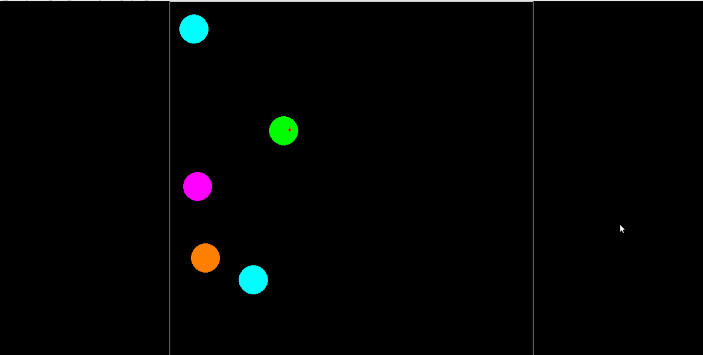
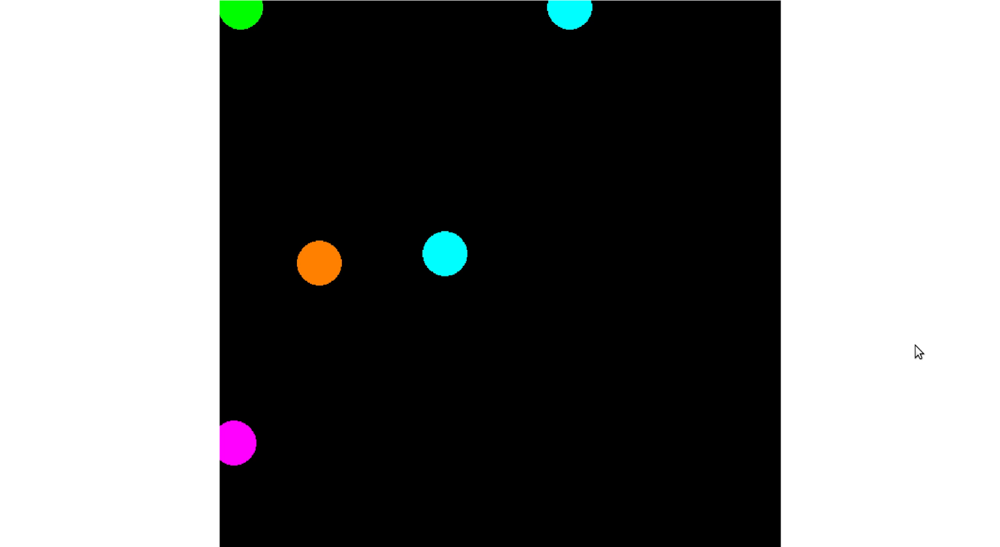
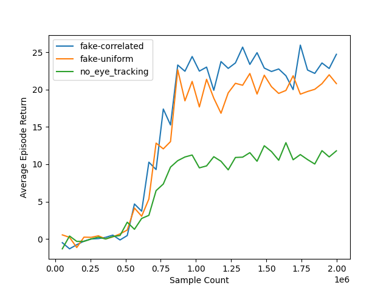

# Abstract

This project demonstrates a system in which a reinforcement learning agent incorporates implicit signals from a human in order to achieve its goals. I use the term *implicit signals* to refer to signals generated by a human that are not direct or explicit feedback. Here I show how such signals can be used by an RL agent to improve its performance in completing its task. 

In particular, this demonstration uses eye tracking data from a human as the implicit signal. While the agent is able to learn to perform its task on its own, by incorporating the eye tracking data the agent is able perform the task better \- achieving a higher score overall. However, based on these preliminary results the performance is still lower than providing random, uncorrelated eye tracking data. Further research is required.

# Motivation

I believe that assistive AI agents, those that enhance human capabilities, must understand their human user in order to predict their needs, understand their intentions and take action either on their behalf or in concert with the user.

To date, the majority of the systems I have seen are very limited in their abilities to capture context from users. For example, current chatbots, such as ChatGPT rely solely on what is communicated through text. In the case of RL-based systems, learning from human feedback has tended to be very explicit in nature and also very limited in the amount of information that it carries. For example, many RL-based systems human-feedback algorithms rely on the user to directly provide reward or punishment through a button push. This is a very limited form of feedback and a burden to the user.

I wanted to reduce the burden placed on the user by allowing the agent to learn from the other *implicit* signals that the user gives. In the broader context than this demonstration, these might include signals like: heart rate, galvanic skin response, tone of voice, posture, EEG, pupil dilation, etc.

In this project I set out to demonstrate some concepts I've been thinking of around human-AI interaction. The core ideas are:

* AI and humans working together can do more than each individually.  
* Today, human feedback is primarily limited to text, but humans generate numerous other signals that can be informative and help an agent to improve its behavior.  
* Providing feedback should be easy, intuitive, and nonintrusive \- ideally the human never needs to be explicit.  
* The human feedback may or may not be available. The system should be able to carry out its task independently.

This project is heavily inspired by the following paper:   
Veeriah, V., Pilarski, P. M., & Sutton, R. S. (2016). Face valuing: Training user interfaces with facial expressions and reinforcement learning. 2016 IJCAI Workshop on Interactive Machine Learning. 

However, there are some significant differences. In this paper the user explicitly gives punishment signals when the agent is not behaving as desired. The agent is unable to solve the task itself. The agent learns a mapping from facial expressions to a value estimate, and lacks any other observation information. Because of this the human’s facial expression effectively becomes a *controller* \- frown to get the agent to do one action, smile to get it to do another.

Here I've tried to take a different approach such that the agent is still able to work on the task itself, but benefits from integrating information from the user when it is available.  
Further, in my system the facial features are just another source of information that is provided to the network.

# Description

The environment is meant to mimic the situation where an agent is carrying out a task, and when available, can observe information coming from the user. Such observations might carry information that is otherwise hidden from the agent, information that only the user is aware of, such as their own preferences.

The environment is a simple 2D navigation task in which the agent learns to collect pink pellets while avoiding blue pellets. Additionally, one of the pink pellets is an extra high-value target, worth more than the other pink pellets. However, the agent has no information about this high-value target and therefore cannot explicitly seek it out. On the other hand the user *can* see the high-value target marked in green. The system tracks the user's eye gaze data and provides this as feature inputs to the agent. Every time the user touches a pellet a new one, of the same time is randomly generated somewhere in the arena. The environment runs in rounds of 100 steps in length. The round timer counts to zero the high-value target is randomly selected from the available pink pellets. The round timer is then reset. The round timer affects the value of the high-value target. The value linearly decays as the round progresses, thus the pellet is worth more at the beginning of the round.

  
Figure 1\. Game arena. The agent is orange. Pink pellets should be collected, blue should be avoided. Green is a pink pellet that has extra high value. A small red crosshair is shown on the green circle, indicating the eye tracking data.

Interface when the eye tracking data is lost:  
  
Figure 2\. The sides of the screen turn white when eye tracking data is lost.

# Results

The following plot shows the average episode return (sum of rewards) over 20 episodes for each model clock. Each series is a different evaluation scenario:

* *fake-correlated* \- This uses fake eye tracking data where the fake data is generated by a Gaussian centered at the high-value pellet  
* *fake-uniform* \- This uses fake eye tracking data that is generated randomly across the entire arena. It is uncorrelated with the high-value pellet.  
* *no\_eye\_tracking* \- No eye tracking data is given to the agent. It has no information about which pellet is the high-value pellet.

  
Figure 3\. Average Episode Return by model clock (counted by Sample Count)

From these results we see:

1. The agent learns to collect pink pellets without any eye-tracking data.  
2. Even adding the fake-uniform data significantly improved the score.  
3. Adding fake-gaussian data resulted in the best performance.

From observing the agent behavior I can tell that this model is not performing optimally. The agent often gets stuck \- it will simply sit in one spot on the screen. I believe this is why adding the *fake-uniform* data results in higher-performance: it dislodges the model from its local behavior minimum, getting the agent unstuck.

A video of usage can be found here: [bikkle.mp4](https://drive.google.com/file/d/1l0fruPCZUU2u2sFlQa1pMVn3H5Tqu6_3/view?usp=sharing)

## Real-EyeTracking Data

Videos of using the system can be found here:

I make the following observations:

* The eye gaze is really noisy and hard to work with. The Gaussian model I used for the fake data is not representative of reality. This results in many cases where the data does not come close to matching where I look.  
* The system does appear to have learned to correlate the eye-gaze data with higher reward. However, the behavior is inconsistent. At times it appears to use the gaze as expected, moving to the nearest pink pellet. At other times it appears to give the eye-gaze the full focus, following the eye-gaze irregardless of the location of the pink pellets or even into blue pellets.

I conducted an experiment in which I followed the same evaluation protocol as Figure 3\. I ran 20 episodes where I used the system myself using a saved model associated with model clock 1740800 (chosen from Figure 3). While the results are far better than without the use of eye tracking data, they are not as good as using the uncorrelated fake data. Further investigation is required.

|  | Average Return over 20 episodes |
| :---- | :---- |
| Human | 18.68 |
| fake-correlated | 25.94 |
| fake-uniform | 19.38 |
| no\_eye\_tracking | 11.29 |

# Method

The agent is a reinforcement learning agent \- it interacts with its environment and receives rewards and punishments based on the results of its actions. The agent's goal is to learn a policy (a mapping from observations to actions) that maximizes the sum of future rewards that it receives.

## Model

The model uses a 2 layer self-attention based architecture followed by an aggregation. The policy follows this with MLPs to produce mean and standard deviation for actions represented as Gaussians. The value function follows the aggregation with an MLP to predict value.

The reason for choosing a self-attention based approach is that I wanted to be able to support varying numbers of pellets and have the ability to add or remove various modalities as needed, such as the eye-tracking data. The inputs to the model are:

* Agent position  
* Pellet: positions relative to the agent position, pellet type (pink or blue). There are multiple pellets so this can be variable length.  
* Eye tracking: Eye tracking data relative to center of the window  
* Steps: The normalized number of steps into the round, starting from 0 and hitting 1.0 at the end of a round

## Training

I used the PPO reinforcement learning algorithm for training. PPO is an online algorithm, it collects samples from the current policy and trains against those directly. After some limited experiments with eye tracking, it seemed unlikely that the existing training regime was sample efficient enough to learn to make use of the user’s eye tracking data in a reasonable amount of time. To counter this I used a false eye-tracking signal during training. This was generated adding Gaussian noise to the position of the high-value block. Thus, the false eye-tracking signal was noisy, but correlated with the position of the high-value block.

## Libraries

The following tools were used for development, among others:

* EyeGestures ([https://github.com/NativeSensors/EyeGestures](https://github.com/NativeSensors/EyeGestures)):  
  Used for eye tracking. The signal is highly noisy and difficult to use. I think I would look for other options or look into improving performance in some way.  
* PyCharm w/ CoPilot:   
  I used this project as a first foray into “vibe coding” \- using an LLM to do most of the coding. Overall it was a good experience.  
* LeanRL ([https://github.com/pytorch-labs/LeanRL](https://github.com/pytorch-labs/LeanRL)):  
  Pytorch implementations of popular RL algorithms in a single-file format. This version is refactored from the original CleanRL project to use `torch.compile` and cudaGraphs. However, I was unable to get the cudaGraphs options to work on my computer.

# Limitations

* The behavior of the policy is a bit off. Sometimes it just gets stuck in some location and won’t move. In these cases having the uniform random eyetracking data seemed to help it move out of these situations. At times the model seemed to prefer to just track the eye-gaze location rather than use it as a guide to find the high-value pellet. This could involve it following the eye tracking data to areas of the screen that had no pellets.  
* Training is slow in terms of number of samples and clock time.  
* The eye-tracking data is very unreliable and noisy.  
* PPO is likely not the right algorithm to use. I believe this approach would benefit from an approach closer to soft-actor critic.  
* Training depended on using fake eye-tracking data rather than training from user data in an online fashion.  
* The human was at somewhat of a disadvantage when evaluating the system due to several factors: 1\. There is no delay between the start of the episode and the first step. 2\. There is a timing issue that causes the eye tracking data to be somewhat delayed.

---
Current python version: 3.10.16
`pip install -r requirements.txt`

Train a model (6.5 hours on my computer)

```
sh ./exp_ppo_self_bikkle2.sh
```

---

This project was implemented as a first attempt at "vibe coding". This is the idea of doing most of the coding through
an LLM agent. Also, my focus was more on speed of development rather than production quality.
Thus, the overall layout of the project is not overly clean.
When I wanted to make some changes, such as using a different model, I just copy-pasted rather than trying to implement
a more general purpose system. In particular, I generally prefer a system closer to what I've implemented in other
projects such as the experiment file
https://github.com/csherstan/triangles/blob/main/scripts/experiments/gym_envs/mountain_car.py

The primary files to consider are:

- `leanrl_ppo_selfattention.py`: this is the main script for training the RL agent
- `drive_eye_tracking.py`: drive the agent around the arena using arrow keys while
displaying the eye tracking data
- `env.py`: All of the various definitions for the environment and the various environment wrappers I used to work with
it.
- `model.py`: All of the various models I experimented with
- `eval_selfattention.py`: Loads models from the checkpoint file(s) and runs evals in 3 different settings:
  1. `fake`: Uses fake eye tracking data that was used during training. This is just Gaussian noise centered on the high
  value block.
  2. `fake-uniform`: fake eye tracking data is provided, but it is just uniform noise sampled over the whole arena. Not
  correlated with the high value block.
  3. `no_eye_tracking`: No eye tracking tokens are provided.
- `view_eval_selfattention.py`: Used for human driven interaction with actual eye tracking data given a trained model.
